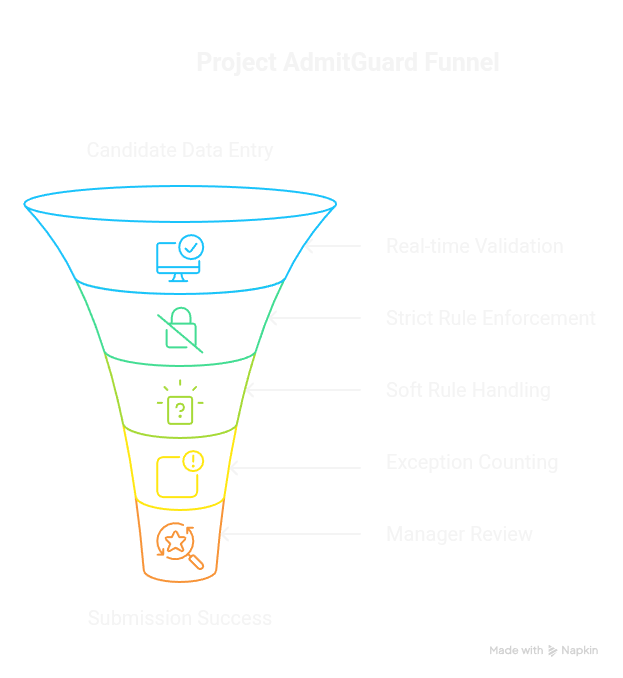
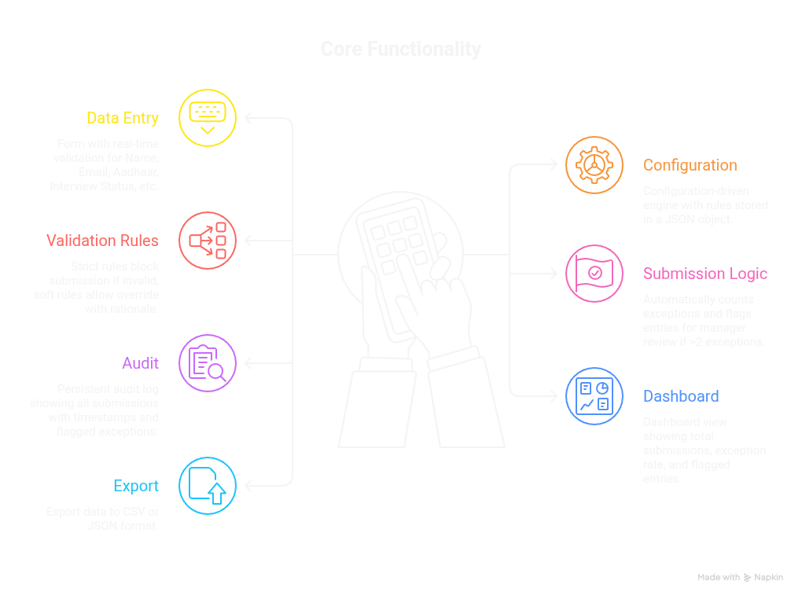

**Project AdmitGuard**

* **Objective** : Design a lightweight application to replace unstructured Excel/Google Sheets with a form-based system that enforces complex eligibility rules.
* **Business Problem** : Ineligible candidates are currently caught too late in the funnel, causing wasted operational hours, poor candidate experience, and compliance risks.

| **#**     | **Requirement**                                                              | **Priority** |
| --------------- | ---------------------------------------------------------------------------------- | ------------------ |
| **FR-1**  | Form-based data entry for all 11 candidate fields                                  | Must Have          |
| **FR-2**  | Real-time field-level validation (validates as user types/selects)                 | Must Have          |
| **FR-3**  | Strict rules block submission with clear error messages                            | Must Have          |
| **FR-4**  | Soft rule violations show exception toggle + rationale field                       | Must Have          |
| **FR-5**  | Rationale field validates for minimum length + required keywords                   | Must Have          |
| **FR-6**  | Exception count per candidate computed and displayed                               | Must Have          |
| **FR-7**  | Submission success screen with summary of entered data                             | Must Have          |
| **FR-8**  | Rules are configurable (stored as a JSON/config object, not hardcoded in UI logic) | Should Have        |
| **FR-9**  | Audit log showing all submissions with timestamps + exceptions flagged             | Should Have        |
| **FR-10** | Dashboard view showing total submissions, exception rate, flagged entries          | Good to Have       |
| **FR-11** | Export data to CSV/JSON                                                            | Good to Have       |
| **FR-12** | Light/dark mode toggle                                                             | Good to Have       |

## Core Functionality

* **Data Entry** : A form (e.g., Name, Email, Aadhaar, Interview Status, etc) with real-time validation.
* **Config : **configuration-driven engine where rules are stored in a JSON object rather than hardcoded.
* **Validation Rules** :
* **Strict Rules** : Mandatory fields (like Aadhaar or Email) that block submission if invalid.
* **Soft Rules** : Thresholds (like GPA or Age) that block by default but allow an override if a **structured rationale** (min. 30 characters + specific keywords) is provided.
* **Submission Logic ** : Automatically counts exceptions or soft rule violations; if a candidate has >2 exceptions, the entry is flagged for manager review.
* **Audit ** : Must include a persistent audit log showing all submissions with timestamps plus exceptions flagged
* **Dashboard** : Dashboard view showing total submissions, exception rate, flagged entries
* **Export : **Export data to CSV/JSON
